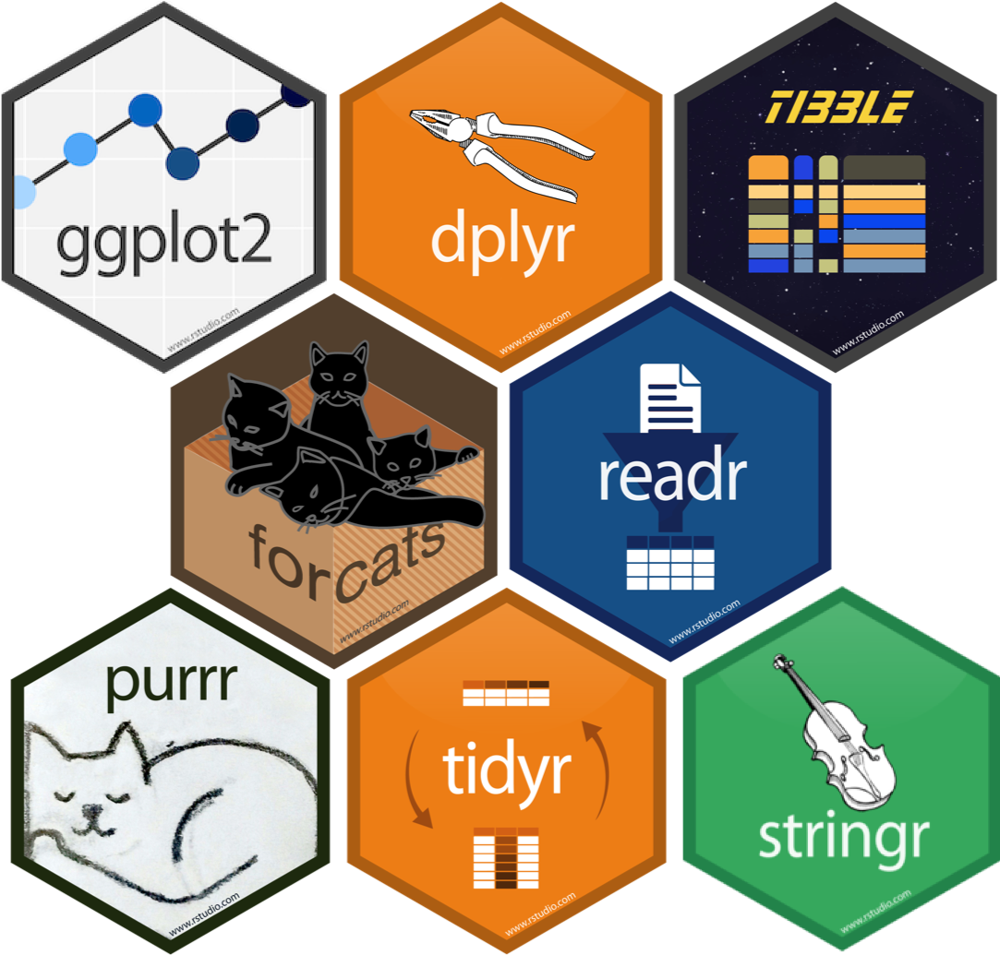
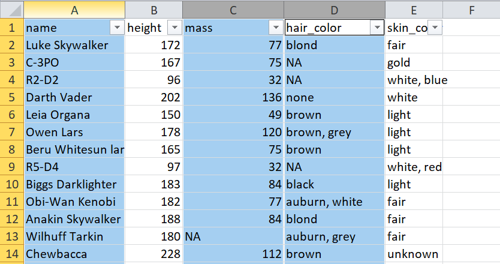
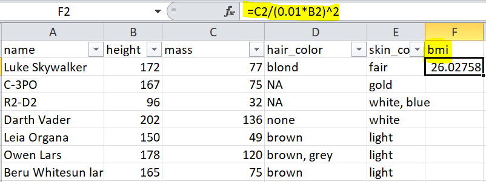
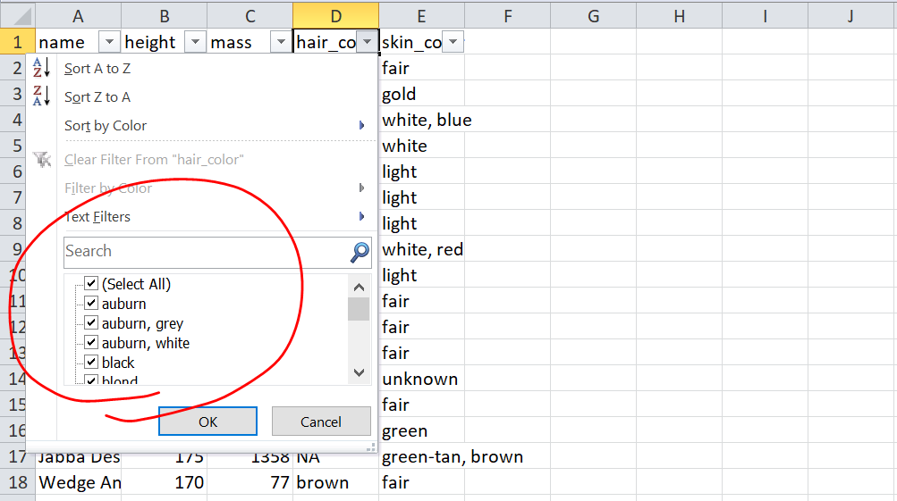
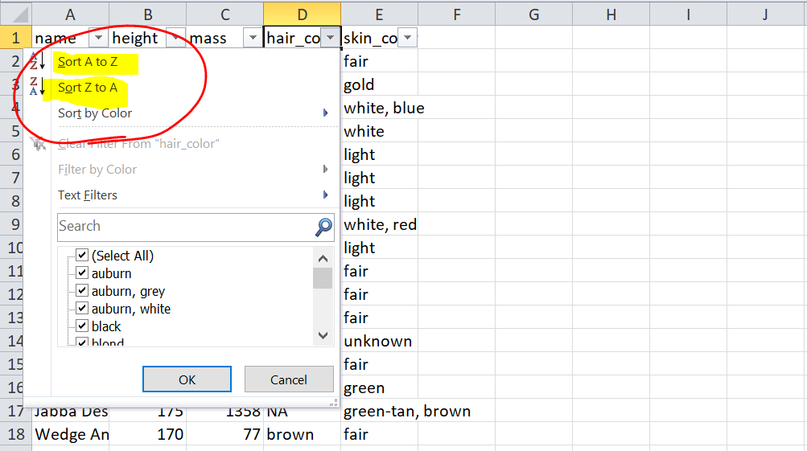
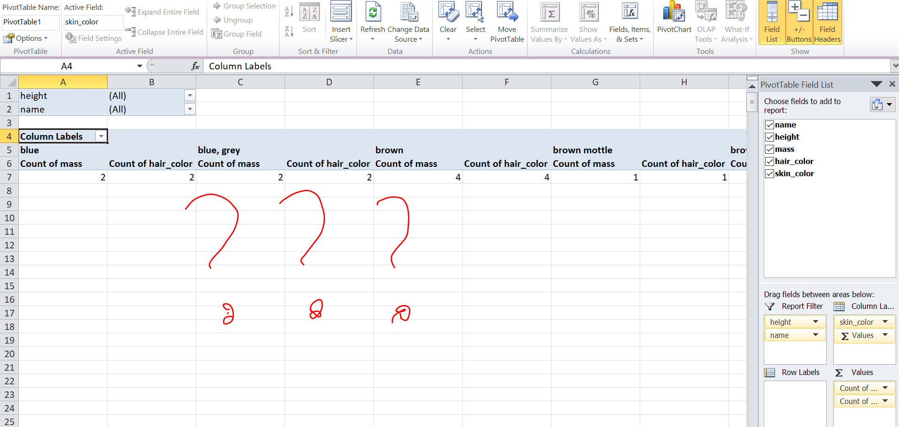

```{r setup, include=FALSE}
options(htmltools.dir.version = FALSE)
library(tidyverse)
library(ggplot2)
library(icon)
```

```{r use-logo, echo=FALSE}
xaringanExtra::use_logo("img/tidyverse.png")
```

# Tidyverse is a collection of packages
.center[

]

---

# The advantages

.large[
- shared syntax & conventions


- tibble/data.frame in, tibble out

- neat code

]
---

# Tidy data

>If I had one thing to tell biologists learning bioinformatics, it would be “write code for humans, write data for computers”.
>
>— Vince Buffalo (@vsbuffalo) July 20, 2013

---

|Film                       |Gender |Race   | Words|
|:--------------------------|:------|:------|-----:|
|The Fellowship Of The Ring |Female |Elf    |  1229|
|The Fellowship Of The Ring |Male   |Elf    |   971|
|The Fellowship Of The Ring |Female |Hobbit |    14|
|The Fellowship Of The Ring |Male   |Hobbit |  3644|
|The Fellowship Of The Ring |Female |Man    |     0|
|The Fellowship Of The Ring |Male   |Man    |  1995|
|The Two Towers             |Female |Elf    |   331|
|The Two Towers             |Male   |Elf    |   513|
|The Two Towers             |Female |Hobbit |     0|
|The Two Towers             |Male   |Hobbit |  2463|

---

# Does your code resemble this?

```{r}
starwars_human_subset <- subset(starwars,species == "Human")
starwars_human_subset$bmi <- starwars_human_subset$mass / 
  (0.01 * starwars_human_subset$height)^2
fattest_human_from_each_planet <- aggregate(bmi ~ homeworld,data = 
      starwars_human_subset, FUN = "max")
fattest_human_from_each_planet <- merge(
  x=fattest_human_from_each_planet,
  y=starwars_human_subset,by = c("homeworld","bmi"))
fattest_human_from_each_planet <- fattest_human_from_each_planet [,1:5]
```


---
# Code should be pleasant to read


---
# Tibbles

>Tibbles are data.frames that are lazy and surly: **they do less** (i.e. they don't change variable names or types, and don't do partial matching) and **complain more** (e.g. when a variable does not exist). This forces you to confront problems earlier, typically leading to cleaner, more expressive code.

.center[

]

https://tibble.tidyverse.org/

---
# `data.frame`

```{r}
iris
```

---
# Tibbles print nicely!

```{r warning=FALSE,message=FALSE}
library(tidyverse)
as_tibble(iris)
```

---

# Pipe ("then")

.pull-left[

]

.pull-right[
Data in, data out


```r
do_another_thing(do_something(data))

# versus

data %>% 
    do_something() %>% 
    do_another_thing() 
```
]

.footnote[
* keyboard shortcut: ctrl/cmd + shift + m
]
--- 
---

class: inverse, center, middle

# Let's go over the various packages
---

class: center, middle

# `readr` package


---

# read_xxx function

* Neater import than `read.table` and `read.csv`

* Does data check and prints a report of the data imported

* Character columns are not converted to factors

* Most useful are `read_csv`, `read_table`, and `read_delim`

* Competible with pipe workflow

---
# Example

```{r}
mydata<- read_csv("data/sub_PanTHERIA.csv")
```

---

```{r}
mydata
```


---
class: center, middle

# `janitor` package


---
# `clean_names()` function

* cleans the column names to something more computer friendly

* For example, brings all the column names to lowercase and adds underscores between words
---

# Regular column names
```{r}
mydata
```

---
# Clean column names

```{r}
mydata %>% 
  janitor::clean_names()
```
---

# Can also be:
```{r warning=FALSE,message=FALSE}
mydata<- read_csv("data/sub_PanTHERIA.csv") %>% 
  janitor::clean_names()
mydata
```

---
class: exercise, center, middle

# Lets practice!

## Load the data and change all the column names to caps lock

.footnote[
**Hint:** Check the help file for the `clean_names()` function
]
---
class: center, middle
# `dplyr` function


---
# Load the Star Wars data

```{r}
library(tidyverse)
data(starwars)
starwars
```

---

# `select()`



---
# Select the name, height, mass, and species columns only

```{r}
starwars %>% 
    select(name, height, mass, species)
```

---

# `mutate()`


---
# Add a bmi column


```{r}
starwars %>% 
    select(name, height, mass, species) %>% 
    mutate(bmi = mass/(0.01*height)^2)
```

---

class: exercise, center, middle

# Your turn!

## select the height, gender, and species and add a new column with height in meters

---

# `filter()`



---
# Filter the data to have only Droids (found in species column)


```{r}
starwars %>% 
    select(name, height, mass, species) %>% 
    mutate(bmi = mass/(0.01*height)^2) %>% 
    filter(species == "Droid")
```

---
# Filter the same data to have only Droids shorter than 100 cm


```{r}
starwars %>% 
    select(name, height, mass, species) %>% 
    mutate(bmi = mass/(0.01*height)^2) %>% 
    filter(species == "Droid", height < 100)
```

---

# `arrange()`


---

# Sort the data based on the bmi

```{r}
starwars %>% 
    select(name, height, mass, species) %>% 
    mutate(bmi = mass/(0.01*height)^2) %>% 
    arrange(desc(bmi))
```

---
# `group_by(), summarize()`




---

## Create a summary data in which you have the avarage mass and maximum hight each species, and sort it by the avarage mass


```{r}
starwars %>% 
    select(name, height, mass, species) %>% 
    group_by(species) %>% 
    summarize(avg_mass = mean(mass, na.rm = TRUE),
              max_height = max(height, na.rm = TRUE)) %>% 
    arrange(desc(avg_mass))
```

---

class: exercise, middle

# Your turn!

What is the most common eye color?

Who is the youngest human?

Which homeworld has the most characters?

---
# Rename columns with `rename()`
```{r}
starwars %>% 
    select(name, height, mass, species) %>% 
    rename(char_name = name)
```
---

# `rename_all()`

Change all the column names to upper case
```{r}
starwars %>% 
    select(name, height, mass, species) %>% 
    rename_all(toupper)
```

---
# `left_join()`

```{r}
starwars %>% 
  mutate(height_m = height*0.01) %>% 
  select(name,height_m) %>% 
  left_join(starwars,by = "name")
```


---

class: exercise, center, middle

# Practice time!

Create a new data with species mass, calculate the bmi, and join it with the starwars data

---
# What else can you do?

- conditional functions: `*_at`, `*_if`, `*_all`
- `lead` & `lag` for time series
- `inner_join`,`semi_join`
- `bind_cols`, `bind_rows`

---
class: center, middle

# `tidyr` functions


---

### spread == pivot_wider

### gather == pivot_longer


---

# Community matrix!

```{r}
sw <- starwars %>% 
  select(name, films) %>% 
  unnest(films) %>% 
  mutate(present = 1) %>% 
  pivot_wider(names_from = name,values_from = present,values_fill = list(present = 0)) %>% 
  janitor::clean_names() %>% 
  print()
```

---

# Gather back the community matrix to a long format

```{r}
sw %>% 
  pivot_longer(cols = -films,names_to = "name",values_to = "present")
```
---

class: exercise, center, middle

#Lets practice!

create a long format of the subset data of species, mass, height, and birth year with the species column, one column with the categories mass,height, birth year and one column with the values

---

.center[
# Other function that are compatible with ` %>% `
]


---

## `ggplot2` 

* can be piped into the sequence
```{r fig.height=4, fig.width=4, message=FALSE, warning=FALSE}
starwars %>% 
  select(height,mass,species) %>% 
  ggplot(.,aes(log10(mass),log10(height),color = species))+
  geom_point()+
  theme(legend.position = "none")
```

---
### omit all rows that contain `NA` somewhere in the data

```{r}
starwars %>% 
  na.omit() #<<
```

---
# Run models on subset of the data

```{r}
starwars %>% 
  filter(species =="Droid") %>% 
  lm(height~mass,data = .) %>% 
  summary()
```

---

# Make it into a nice tibble

```{r}
starwars %>% 
  filter(species =="Droid") %>% 
  lm(height~mass,data = .) %>% 
  summary()%>% 
  broom::tidy() #<<
```

---

class: inverse, center, middle

# Homework Time

---

# Some instructions

- Uninstall the previous lesson with

  `uninstall_course("exercise_REcoStat2020")`
  
- Re-install it with `install_course_github("marianovosolov","exercise_REcoStat2020")`

- Start with `swirl()`

- Give it a new name

- Choose the tidyverse exercise within the exercise_REcoStat2020

- Good luck!!