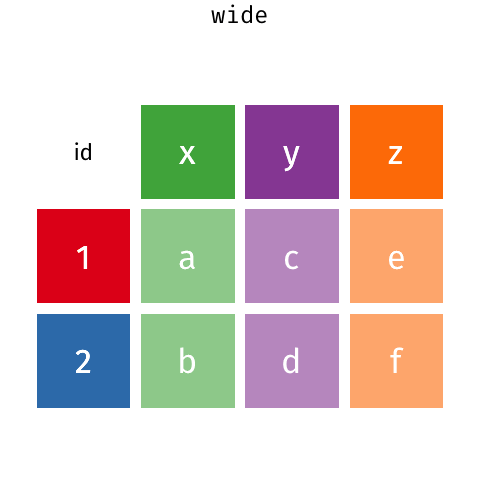

```{r setup, include=FALSE}
options(htmltools.dir.version = FALSE)
library(tidyverse)
library(ggplot2)
library(icon)
```

```{r use-logo, echo=FALSE}
xaringanExtra::use_logo("img/tidyverse.png")
```

# Tidyverse is a collection of packages
.center[

]

---

# The advantages

.large[
- shared syntax & conventions


- tibble/data.frame in, tibble out

- neat code

]
---

# Tidy data

>If I had one thing to tell biologists learning bioinformatics, it would be “write code for humans, write data for computers”.
>
>— Vince Buffalo (@vsbuffalo) July 20, 2013

---

|Film                       |Gender |Race   | Words|
|:--------------------------|:------|:------|-----:|
|The Fellowship Of The Ring |Female |Elf    |  1229|
|The Fellowship Of The Ring |Male   |Elf    |   971|
|The Fellowship Of The Ring |Female |Hobbit |    14|
|The Fellowship Of The Ring |Male   |Hobbit |  3644|
|The Fellowship Of The Ring |Female |Man    |     0|
|The Fellowship Of The Ring |Male   |Man    |  1995|
|The Two Towers             |Female |Elf    |   331|
|The Two Towers             |Male   |Elf    |   513|
|The Two Towers             |Female |Hobbit |     0|
|The Two Towers             |Male   |Hobbit |  2463|

---

# Does your code resemble this?

```{r}
starwars_human_subset <- subset(starwars,species == "Human")
starwars_human_subset$bmi <- starwars_human_subset$mass / 
  (0.01 * starwars_human_subset$height)^2
fattest_human_from_each_planet <- aggregate(bmi ~ homeworld,data = 
      starwars_human_subset, FUN = "max")
fattest_human_from_each_planet <- merge(
  x=fattest_human_from_each_planet,
  y=starwars_human_subset,by = c("homeworld","bmi"))
fattest_human_from_each_planet <- fattest_human_from_each_planet [,1:5]
```


---
# Code should be pleasant to read


---
# Tibbles

>Tibbles are data.frames that are lazy and surly: **they do less** (i.e. they don't change variable names or types, and don't do partial matching) and **complain more** (e.g. when a variable does not exist). This forces you to confront problems earlier, typically leading to cleaner, more expressive code.

.center[

]

https://tibble.tidyverse.org/

---
# `data.frame`

```{r}
iris
```

---
# Tibbles print nicely!

```{r warning=FALSE,message=FALSE}
library(tidyverse)
as_tibble(iris)
```

---

class: inverse, center, middle

# Let's go over the syntax

---
# `dplyr` function

.center[

]

---

# `select()`


---

# `filter()`


---
# `arrange()`


---

# `mutate()`


---

# `group_by(), summarize()`


---

# Pipe ("then")

.pull-left[

]

.pull-right[
Data in, data out


```r
do_another_thing(do_something(data))

# versus

data %>% 
    do_something() %>% 
    do_another_thing() 
```
]


--- 
---
class: inverse, center, middle

# Lets start practicing 
---

# Load the Star Wars data

```{r}
library(tidyverse)
data(starwars)
starwars
```
---
# Select the name, height, mass, and species columns only

--
```{r}
starwars %>% 
    select(name, height, mass, species)
```

---

# Add a bmi column (`mass/(0.01*height)^2`)

--
```{r}
starwars %>% 
    select(name, height, mass, species) %>% 
    mutate(bmi = mass/(0.01*height)^2)
```

---

# Sort the data based on the bmi
--
```{r}
starwars %>% 
    select(name, height, mass, species) %>% 
    mutate(bmi = mass/(0.01*height)^2) %>% 
    arrange(desc(bmi))
```

---

# Filter the data to have only Droids (found in species column)

--
```{r}
starwars %>% 
    select(name, height, mass, species) %>% 
    mutate(bmi = mass/(0.01*height)^2) %>% 
    filter(species == "Droid")
```

---

# Filter the same data to have only Droids shorter than 100 cm

--
```{r}
starwars %>% 
    select(name, height, mass, species) %>% 
    mutate(bmi = mass/(0.01*height)^2) %>% 
    filter(species == "Droid", height < 100)
```

---

## Create a summary data in which you have the avarage mass, maximum hight, and the number of individuals from each species, and sort it by the number of individuals
--

```{r}
starwars %>% 
    select(name, height, mass, species) %>% 
    group_by(species) %>% 
    summarize(count = n(),
              avg_mass = mean(mass, na.rm = TRUE),
              max_height = max(height, na.rm = TRUE)) %>% 
    arrange(desc(count))
```

---

class: inverse, center, middle

# Your turn
---

- What is the most common eye color?
- Who is the youngest human?
- Which homeworld has the most characters?

---

# What else can you do?

- conditional functions: `*_at`, `*_if`, `*_all`
- `rename` columns
- `lead` & `lag` for time series
- `join` & `bind` data frames
- `count` & `tally` shortcuts for group_by and summarize

`pivot_wider()` and `pivot_longer()`

---


---

# Community matrix!

```{r}
sw <- starwars %>% 
  select(name, films) %>% 
  unnest(films) %>% 
  mutate(present = 1) %>% 
  pivot_wider(names_from = name,values_from = present,values_fill = list(present = 0)) %>% 
  janitor::clean_names() %>% 
  print()
```

---

# Gather back the community matrix to the data

```{r}
sw %>% 
  pivot_longer(cols = -films,names_to = "name",values_to = "present")
```


